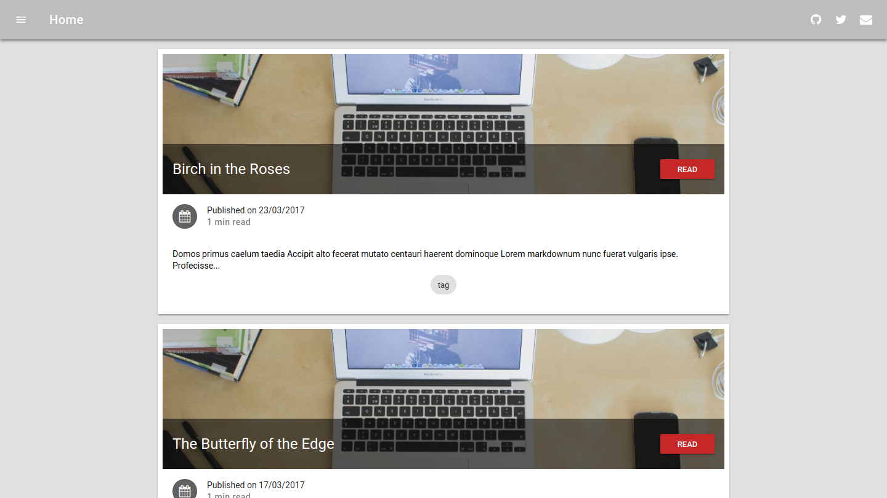

    

# The Pedestrians Post, 日常大眾.

A simple blog written by a regular people, no crazy idea, no high-end products, no fancy restaurants... Just some regular days, regular thing...

[Go to The Pedestrains Post Website](https://i-will-do-it-later-after-i-get-my-domain)

## Products

Introduce products that everybody can afford, so there's not going to have supercar, million dollars mansion, yacht, private jet... you know the idea.

## Tech

Introduce some new finds on the internet. There probably won't be a bunch of latest and greatest laptops, or mobile phones... Since... As a regular people, who's gonna have multiple phones or whatever at the same time? Unless someone sends me some demo unit? It's probbaly not my concern for now :P

## Books

I do read, but not quite often. It might be a good start from here :D

## Exhibitions

I do enjoy different exhibition, but doesn't have to much time for that. There's a lot of things going on in Taiwan (whether it's good or bad). It's going to be a cool activity to do :P

## Travel

I don't really have to much time to traveling around, just like other people working in the office. 
But I really love the idea of traveling, maybe I'll try to do more in the future :D

## Something else

Basically everything a regular man can do on this planet earth. That's why this blog called "The Pedestrians Post".

---

This Blog is built with gatsby by my bare hands.
 
Why? Because I can.
 
&copy; 2019 LCTOAN., All rights reserved.
